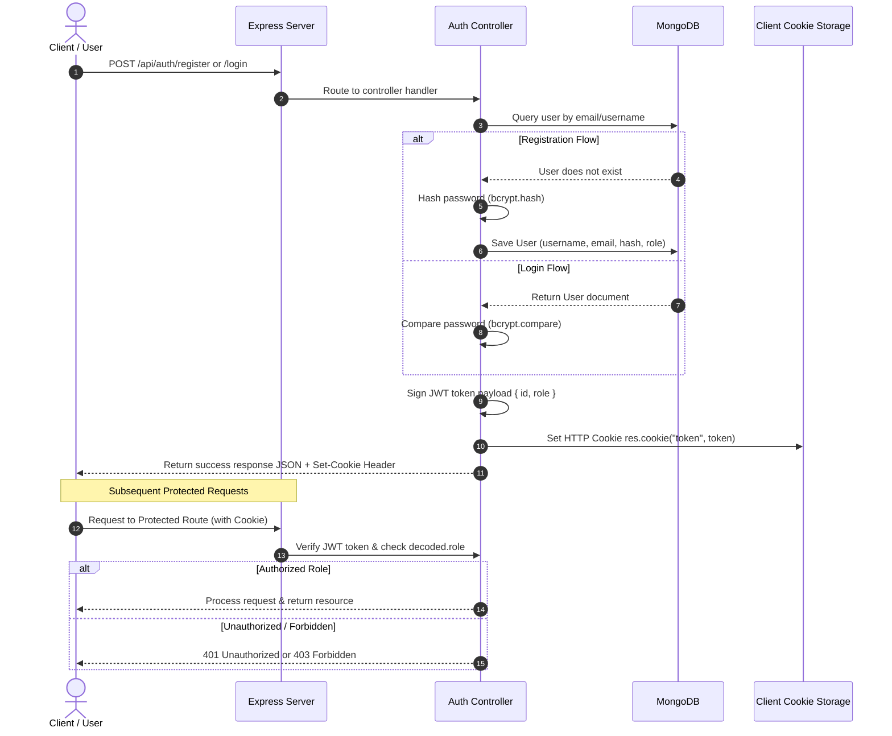

# Node.js Backend Development

Welcome to my **Node.js & Express.js Learning & Practice Repository**. This codebase tracks my progression from core Node.js runtime fundamentals to building production-ready RESTful APIs, integrating MongoDB databases, handling file/image uploads to cloud storage, implementing JWT and cookie-based authentication, and structuring scalable backend applications.

---

## 📋 Table of Contents

- [Overview](#nodejs-backend-development)
- [📚 What I Learned](#-what-i-learned)
- [📂 Repository Structure](#-repository-structure)
- [🛠️ Technologies Used](#️-technologies-used)
- [🔌 API Concepts & Routes](#-api-concepts--routes)
- [🔐 Authentication & Authorization Flow](#-authentication--authorization-flow)
- [🗄️ Database & Schemas](#️-database--schemas)
- [🧩 Middleware Architecture](#-middleware-architecture)
- [☁️ Cloud Storage & Image Uploads](#️-cloud-storage--image-uploads)
- [💻 Frontend & Backend Integration](#-frontend--backend-integration)
- [🧪 Testing & Validation](#-testing--validation)
- [🚀 Getting Started](#-getting-started)
- [📖 Learning Roadmap](#-learning-roadmap)
- [💡 Key Concepts](#-key-concepts)
- [🎯 Learning Outcomes](#-learning-outcomes)
- [🔮 Future Improvements](#-future-improvements)

---

## 📚 What I Learned

Below is a breakdown of topics studied throughout the course curriculum and how they correlate with the codebase implementation:

### Core Fundamentals & Server Basics
- **Node.js Runtime & Architecture**: Single-threaded event loop, asynchronous non-blocking I/O, event-driven model.
- **npm & Package Management**: Project initialization (`package.json`), dependency management, global vs local packages.
- **Modules**: CommonJS module system (`require` and `module.exports`), ES Modules syntax (`import`/`export` in Vite React frontend).
- **HTTP Basics**: Fundamentals of HTTP requests, responses, status codes (`200 OK`, `201 Created`, `401 Unauthorized`, `403 Forbidden`, `409 Conflict`).

### Web Framework & REST APIs
- **Express.js Framework**: Initializing Express servers, routing system (`express.Router()`), request handlers, application listening.
- **RESTful API Principles**: CRUD design patterns, standard endpoints, HTTP verbs (`GET`, `POST`, `PATCH`, `DELETE`).
- **Request Parsing**: Body parsing (`express.json()`), URL params (`req.params`), Query params (`req.query`), Multi-part form data processing via `multer`.

### Database & Persistence
- **MongoDB & Mongoose ODM**: Document database design, connecting via Mongoose Atlas URIs (`mongoose.connect`), Schema definitions, Model creation.
- **Database Operations**: Query execution using Mongoose methods (`create()`, `find()`, `findOne()`, `findByIdAndDelete()`, `findOneAndUpdate()`).
- **Data Modeling & References**: Mongoose `Schema.Types.ObjectId` and model population references (`ref: "user"`).

### Authentication & Security
- **User Authentication**: Registration and Login workflows.
- **Password Security**: Hashing passwords using `bcryptjs` before persisting in the database.
- **JSON Web Tokens (JWT)**: Signing tokens with payload data (`user._id`, `role`), setting token expiration, verifying tokens.
- **Cookie Management**: Setting HTTP cookies via `res.cookie()`, reading cookies using `cookie-parser`.
- **Role-Based Access Control (RBAC)**: Distinguishing user roles (`user` vs `artist`), authorizing protected actions.

### File Uploads & Cloud Integration
- **Multer Storage**: Memory storage buffer handling (`multer.memoryStorage()`).
- **Cloud Media Storage**: ImageKit Node.js SDK integration (`@imagekit/nodejs`), uploading buffer streams encoded in Base64.

### Frontend Integration
- **Full-Stack Connection**: Building React frontends with Vite, connecting to Node.js backend using Axios, CORS management via `cors` middleware.

---

## 📂 Repository Structure

The repository is organized into progressive practice projects (`prac1` through `prac6`), each focusing on specific backend concepts:

```text
nodejs/
├── prac1/               # Core Node.js & npm package basics
│   ├── index.js         # Entry file demonstrating npm package usage (cat-me)
│   └── package.json     # Basic dependencies configuration
│
├── prac2/               # Express.js basics & in-memory CRUD
│   ├── server.js        # Server listener initialization (Port 3000)
│   ├── src/
│   │   └── app.js       # Express instance & in-memory Notes API routes
│   └── package.json     # Express dependency setup
│
├── prac3/               # Database Integration (MongoDB & Mongoose)
│   ├── server.js        # Server startup & DB connection launcher
│   ├── src/
│   │   ├── app.js       # Express app with MongoDB CRUD endpoints
│   │   ├── db/
│   │   │   └── db.js    # Mongoose connection setup (MongoDB Atlas)
│   │   └── models/
│   │       └── note.model.js # Mongoose schema for Notes
│   └── package.json     # Express & Mongoose dependencies
│
├── prac4/               # Full-Stack Image Upload (ImageKit + React)
│   ├── backend/         # Node.js backend with Multer & ImageKit SDK
│   │   ├── server.js    # Express server entry point
│   │   ├── src/
│   │   │   ├── app.js   # API routes for post creation & image fetching
│   │   │   ├── db/
│   │   │   │   └── db.js # MongoDB database connection
│   │   │   ├── models/
│   │   │   │   └── post.model.js # Post schema (image URL & caption)
│   │   │   └── services/
│   │   │       └── storage.service.js # ImageKit upload service helper
│   │   └── package.json # Express, Multer, ImageKit, CORS dependencies
│   └── frontend/        # Vite + React Frontend Application
│       ├── src/
│       │   ├── App.jsx  # React Router DOM layout setup
│       │   └── pages/
│       │       ├── CreatePost.jsx # Image upload form with Axios POST
│       │       └── Feed.jsx       # Feed page rendering posts
│       └── package.json # React, Axios, Vite dependencies
│
├── prac5/               # Authentication & JWT Cookies
│   ├── server.js        # Application server entry
│   ├── src/
│   │   ├── app.js       # Express app with auth router & cookie-parser
│   │   ├── db/
│   │   │   └── db.js    # Database connection logic
│   │   ├── models/
│   │   │   └── user.model.js # User schema (username, unique email, password)
│   │   ├── routes/
│   │   │   ├── auth.routes.js # Auth routes (/register, /test)
│   │   │   └── post.routes.js # Placeholder route file
│   │   └── controllers/
│   │       └── auth.controller.js # User registration & JWT cookie handler
│   └── package.json     # Express, Mongoose, JWT, Cookie-Parser
│
└── prac6/               # Advanced Backend / Spotify Project (WIP)
    ├── server.js        # Server entry with nodemon dev setup
    ├── src/
    │   ├── app.js       # Express app mounting auth and music routers
    │   ├── db/
    │   │   └── db.js    # MongoDB connection setup
    │   ├── models/
    │   │   ├── user.model.js  # User schema with roles ('user', 'artist')
    │   │   └── music.model.js # Music schema referencing User ObjectId
    │   ├── routes/
    │   │   ├── auth.routes.js  # Authentication routes (/register, /login)
    │   │   └── music.routes.js # Music API router (WIP)
    │   └── controllers/
    │       ├── auth.controller.js  # Register & Login with Bcrypt & JWT roles
    │       └── music.contoller.js # Role-protected music upload controller (WIP)
    └── package.json     # Express, Mongoose, JWT, BcryptJS, Cookie-Parser
```

### Folder Breakdown & Concept Summary

| Folder | Core Focus | Key Features & Files | Status |
| :--- | :--- | :--- | :--- |
| **`prac1`** | Node.js Basics | Package installation (`cat-me`), CommonJS `require`. | Completed |
| **`prac2`** | Express & In-Memory API | Express app architecture, memory array CRUD for `/notes`. | Completed |
| **`prac3`** | MongoDB & Mongoose | Persistent Notes API with Atlas database, schema design. | Completed |
| **`prac4`** | Cloud Uploads & Frontend | Multer buffer uploads to ImageKit, React Feed UI, CORS. | Completed |
| **`prac5`** | Authentication & Cookies | User Registration API, JWT generation, HTTP cookies. | Completed |
| **`prac6`** | Spotify Backend (RBAC) | Bcrypt hashing, Login/Register APIs, Role-based JWTs, Music model with User references. | Work-in-Progress |

---

## 🛠️ Technologies Used

The following technologies and third-party packages are present in the repository:

| Category | Technology | Purpose | Where Used |
| :--- | :--- | :--- | :--- |
| **Runtime** | Node.js | JavaScript server runtime environment | Entire repository |
| **Framework** | Express.js (`v5.2.1`) | Web framework for routing and middleware | `prac2` – `prac6` |
| **Database** | MongoDB & Mongoose | NoSQL database & Object Data Modeling (ODM) | `prac2` – `prac6` |
| **Authentication** | JSONWebToken (`jsonwebtoken`) | Stateless authentication token generation | `prac5`, `prac6` |
| **Security** | BcryptJS (`bcryptjs`) | Password hashing and validation | `prac6` |
| **Cookie Handling**| Cookie Parser (`cookie-parser`)| Express middleware to parse HTTP request cookies | `prac5`, `prac6` |
| **File Handling** | Multer (`multer`) | Middleware for handling `multipart/form-data` | `prac4/backend` |
| **Cloud Storage** | ImageKit SDK (`@imagekit/nodejs`)| Cloud storage service for storing uploaded images | `prac4/backend` |
| **HTTP Requests** | Axios | Frontend HTTP client for API requests | `prac4/frontend` |
| **Frontend** | React (`v19`), Vite, React Router DOM | Single Page Application framework & routing | `prac4/frontend` |
| **Config & Dev** | Dotenv, Cors, Nodemon | Environment variable management, CORS handling, auto-restarting server | `prac4` – `prac6` |

---

## 🔌 API Concepts & Routes

The codebase features several RESTful API implementations. Below is a detailed listing of all active endpoints discovered across the projects:

### 1. In-Memory Notes API (`prac2`)

- **Base URL**: `http://localhost:3000`

| Method | Endpoint | Description | Request Body | Response Status |
| :--- | :--- | :--- | :--- | :--- |
| `POST` | `/notes` | Create a note in memory array | `{ title, description }` | `201 Created` |
| `GET` | `/notes` | Retrieve all notes from memory | None | `200 OK` |
| `PATCH` | `/notes/:index` | Update note description by index | `{ description }` | `200 OK` |
| `DELETE`| `/notes/:index` | Delete note by index | None | `200 OK` |

### 2. MongoDB Persistent Notes API (`prac3`)

- **Base URL**: `http://localhost:3000`

| Method | Endpoint | Description | Request Body | Response Status |
| :--- | :--- | :--- | :--- | :--- |
| `POST` | `/notes` | Save a new note to MongoDB | `{ title, description }` | `201 Created` |
| `GET` | `/notes` | Fetch all notes from MongoDB | None | `200 OK` |
| `PATCH` | `/notes/:id` | Update note description by Mongo ID | `{ description }` | `200 OK` |
| `DELETE`| `/notes/:id` | Delete note by Mongo ID | None | `200 OK` |

### 3. Image Post API (`prac4/backend`)

- **Base URL**: `http://localhost:3000`

| Method | Endpoint | Description | Request Body | Response Status |
| :--- | :--- | :--- | :--- | :--- |
| `POST` | `/create-post` | Upload image to ImageKit & save post | `multipart/form-data` (`image` file, `caption` text) | `201 Created` |
| `GET` | `/posts` | Fetch all posts with cloud image URLs | None | `200 OK` |

### 4. Basic Auth & Cookie Testing API (`prac5`)

- **Base URL**: `http://localhost:3000/api/auth`

| Method | Endpoint | Description | Request Body | Cookie Response | Status |
| :--- | :--- | :--- | :--- | :--- | :--- |
| `POST` | `/register` | Register user & attach JWT cookie | `{ username, email, password }` | Sets `token` cookie | `201 Created` |
| `GET` | `/test` | Debug route to inspect request cookies | None | Reads `req.cookies` | `200 OK` |

### 5. Spotify Backend Authentication API (`prac6`)

- **Base URL**: `http://localhost:3000/api/auth`

| Method | Endpoint | Description | Request Body | Response & Auth | Status |
| :--- | :--- | :--- | :--- | :--- | :--- |
| `POST` | `/register` | Register user/artist with hashed password | `{ username, email, password, role }` | Sets `token` cookie with role payload | `201 Created` |
| `POST` | `/login` | Authenticate user & verify password | `{ username, email, password }` | Sets `token` cookie | `200 OK` |

---

## 🔐 Authentication & Authorization Flow

Authentication in `prac5` and `prac6` uses a secure token-based approach with JWTs stored in HTTP cookies:



### Detailed Auth Features Implemented:
1. **Password Hashing**: Utilizes `bcryptjs` with salt rounds set to 10 (`prac6`).
2. **JWT Payload**: Encodes both user ID (`user._id`) and user role (`role: 'user' | 'artist'`).
3. **Cookie Transport**: Sends tokens seamlessly via `res.cookie('token', token)`.
4. **Role Verification**: `music.contoller.js` verifies whether the decoded token role equals `'artist'`.

---

## 🗄️ Database & Schemas

The application connects to MongoDB using Mongoose. Here are the models defined across the projects:

### 1. Note Model (`prac3/src/models/note.model.js`)
```javascript
const noteSchema = new mongoose.Schema({
    title: String,
    description: String
});
```

### 2. Post Model (`prac4/backend/src/models/post.model.js`)
```javascript
const postSchema = new mongoose.Schema({
    image: String,   // ImageKit Cloud URL
    caption: String
});
```

### 3. User Model (`prac5/src/models/user.model.js` & `prac6/src/models/user.model.js`)
```javascript
// prac6 model with role-based support
const userSchema = new mongoose.Schema({
    username: { type: String, required: true, unique: true },
    email:    { type: String, required: true, unique: true },
    password: { type: String, required: true }, // Hashed string
    role:     { type: String, enum: ['user', 'artist'], default: 'user' }
});
```

### 4. Music Model (`prac6/src/models/music.model.js`)
```javascript
const musicSchema = new mongoose.Schema({
    uri:    { type: String, required: true },
    title:  { type: String, required: true },
    artist: { type: mongoose.Schema.Types.ObjectId, ref: "user", required: true }
});
```

---

## 🧩 Middleware Architecture

Express middleware plays a core role in request processing across all practice modules:

```text
Incoming Request ──► Built-in Middleware ──► Third-Party Middleware ──► Route Handler ──► Controller ──► Database ──► Response
                      (express.json)           (cors, cookie-parser)
                                               (multer memoryStorage)
```

### Middleware Used in Codebase:
1. **`express.json()`**: Built-in middleware to parse incoming JSON payloads.
2. **`cors()`**: Enables Cross-Origin Resource Sharing between Vite frontend (`localhost:5173`) and Express backend (`localhost:3000`).
3. **`cookie-parser()`**: Parses incoming HTTP cookies into `req.cookies`.
4. **`multer({ storage: multer.memoryStorage() })`**: Intercepts multipart file uploads and holds file contents in a memory buffer (`req.file.buffer`).

---

## ☁️ Cloud Storage & Image Uploads

In `prac4`, image uploading is integrated with **ImageKit**:

```text
User selects file & caption ──► React Form Data ──► POST /create-post
                                                          │
                                                          ▼
ImageKit Storage Cloud ◄── Base64 Upload Buffer ◄── Multer Memory Storage
         │
         ▼
Returns Cloud URL ──► Saved to MongoDB Post document ──► 201 Created Response
```

- **Service File**: `prac4/backend/src/services/storage.service.js`
- **SDK**: `@imagekit/nodejs`
- **Buffer Conversion**: Uploads file buffers converted to base64 (`buffer.toString("base64")`).

---

## 💻 Frontend & Backend Integration

In `prac4`, the repository connects a **React single-page application** to the Node.js API:

- **Frontend Tech**: React 19, Vite, React Router DOM, Axios.
- **Pages**:
  - `CreatePost.jsx`: HTML form with `<input type="file" name="image" />` and caption text input. Uses JavaScript `FormData` to issue an asynchronous `axios.post("http://localhost:3000/create-post", formData)` request.
  - `Feed.jsx`: Uses React `useEffect` hook to send `axios.get("http://localhost:3000/posts")` and render image cards dynamically.

---

## 🧪 Testing & Validation

### Status in Repository
- **Testing Libraries (Jest / Supertest)**: Not installed in `package.json` files. API functionality was manually tested using REST clients (Postman/Thunder Client) and frontend integration.
- **Validation Libraries (express-validator)**: Input verification was performed manually inside controllers (e.g., checking if user exists via `userModel.findOne()`).

*Note: Integrating Jest, Supertest, and `express-validator` are slated as future improvements.*

---

## 🚀 Getting Started

Follow the instructions below to run any of the practice modules on your local machine.

### 1. Prerequisites
- **Node.js**: `v18.x` or higher installed
- **npm**: `v9.x` or higher installed
- **MongoDB**: Active MongoDB Atlas cluster or local instance

### 2. Clone & Navigate
```bash
git clone <repository-url>
cd nodejs
```

### 3. Setup Environment Variables

Create a `.env` file in the root of any practice folder requiring environment configuration (`prac4/backend`, `prac5`, `prac6`).

> [!CAUTION]
> Never commit `.env` files or secrets to version control. Make sure `.env` is listed in your `.gitignore` file.

#### Example `.env` Template:
```env
PORT=3000
MONGO_URI=mongodb+srv://<username>:<password>@cluster.mongodb.net/<dbname>
JWT_SECRET=your_jwt_secret_key_here
IMAGEKIT_PRIVATE_KEY=your_imagekit_private_key_here
```

### 4. Running Individual Projects

#### Running `prac1`
```bash
cd prac1
npm install
node index.js
```

#### Running `prac2`
```bash
cd prac2
npm install
node server.js
```

#### Running `prac3`
```bash
cd prac3
npm install
# Configure MONGO_URI in db.js or env
node server.js
```

#### Running `prac4` (Full-Stack)

1. **Start Backend**:
   ```bash
   cd prac4/backend
   npm install
   # Create .env with MONGO_URI and IMAGEKIT_PRIVATE_KEY
   node server.js
   ```
2. **Start Frontend**:
   ```bash
   cd prac4/frontend
   npm install
   npm run dev
   ```

#### Running `prac5`
```bash
cd prac5
npm install
# Create .env with MONGO_URI and JWT_SECRET
node server.js
```

#### Running `prac6` (Spotify Backend)
```bash
cd prac6
npm install
# Create .env with MONGO_URI and JWT_SECRET
npm run dev
```

---

## 📖 Learning Roadmap

```text
Node.js Architecture & Basics (prac1)
                 │
                 ▼
Express.js Framework & In-Memory CRUD (prac2)
                 │
                 ▼
MongoDB & Mongoose Schema Persistence (prac3)
                 │
                 ▼
Multer & ImageKit Cloud Uploads + React Frontend (prac4)
                 │
                 ▼
User Registration, JWTs & Cookie Authentication (prac5)
                 │
                 ▼
Bcrypt Hashing, Role-Based Access & Spotify Backend (prac6)
```

---

## 💡 Key Concepts

For quick revision and interview preparation:

- **Node.js**: Asynchronous, event-driven JavaScript runtime built on Chrome's V8 engine.
- **Express.js**: Fast, unopinionated, minimalist web framework for Node.js.
- **REST API**: Architectural style for web services using standard HTTP methods and status codes.
- **Mongoose ODM**: Object modeling tool for MongoDB providing schema validation and query building.
- **JWT (JSON Web Token)**: Compact, URL-safe means of representing claims to be transferred between two parties.
- **Bcrypt**: Adaptive password-hashing function designed to protect stored passwords against brute-force attacks.
- **Middleware**: Functions that have access to the request (`req`), response (`res`), and next middleware function in the application cycle.
- **Cookies vs Sessions**: Cookies store session tokens client-side, sent automatically with HTTP requests.
- **Multer**: Node.js middleware for handling multipart form data used primarily for uploading files.

---

## 🎯 Learning Outcomes

After completing this practice repository, I am capable of:

- [x] Setting up modular Node.js and Express server architectures.
- [x] Designing and constructing RESTful APIs following CRUD principles.
- [x] Connecting Node.js backends to MongoDB using Mongoose schemas and models.
- [x] Handling multi-part file uploads and integrating cloud storage solutions (ImageKit).
- [x] Securing user passwords using salted bcrypt hashing algorithms.
- [x] Implementing user registration and login with JWT tokens and HTTP cookies.
- [x] Establishing Role-Based Access Control (RBAC) to restrict protected endpoints.
- [x] Connecting single-page React frontend applications to custom Node.js APIs.

---

## 🔮 Future Improvements

Features and enhancements planned for future practice:

- [ ] Complete Spotify Project music endpoints (`prac6`) including track upload and streaming logic.
- [ ] Add `express-validator` middleware for input validation and sanitization.
- [ ] Integrate automated unit and integration testing using **Jest** and **Supertest**.
- [ ] Implement Refresh Tokens in addition to Access Tokens for enhanced security.
- [ ] Implement central error-handling middleware.
- [ ] Add API rate limiting (`express-rate-limit`) and security headers (`helmet`).
- [ ] Write OpenAPI/Swagger documentation for all endpoints.
